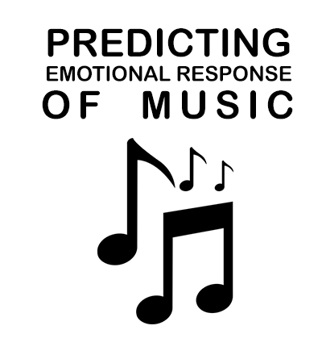

<!-- PROJECT LOGO -->
<br />
<p align="center">
  <a href="https://github.com/othneildrew/Best-README-Template">
    
  </a>

  <h3 align="center">Predicting Emotional Response to Popular Songs</h3>

  <p align="center">
   This project utilize a slew of artificial intelligence techniques to predict if a song elicits positive or negative responses in people. 
    <br />
    <br />
    Look bellow to see how it was made and what the results where!
    <br />
    <br />
  </p>
</p>


<!-- TABLE OF CONTENTS -->
## Table of Contents
* [About The Project](#about-the-project)
	* [Data](#data)
* [Getting Started](#getting-started)
  * [Prerequisites](#prerequisites)
  * [Installation](#installation)
  * [Usage](#usage)
 * [Data Preparation](#data-preparation) 
* [AI Strategies Used](#AI Strategies)
* [Results And Accuracy](#Results)
* [Contact](#contact)


<!-- ABOUT THE PROJECT -->
## About The Project


This project was developed to see what AI strategies work best with predicting a songs emotional response in people (negative or positive), or as Spotify refers to it, a songs valence. The project was done in two sections based upon what features were used. The first section uses Spotify generated features like: key, loudness, danceability, time signature and so on. The second section uses just the songs lyrics. Across both sections I used Logistic Regression, K-Nearest Neighbor, and Naive Bayes in order to predict the songs valence. 

To learn more about how these strategies were used, check out the "AI Strategies" Section bellow.


### Data
Two datasets were used. For the Spotify features and the information on the valence (a song's emotional response), the "19,000 Spotify Songs" dataset was used. For information on a songs lyrics, the 55000+ Song Lyrics dataset was used. Both Datasets were published on Kaggle.
* [19,000 Spotify Songs](https://www.kaggle.com/edalrami/19000-spotify-songs)
* [55000+ Song Lyrics](https://www.kaggle.com/mousehead/songlyrics)


<!-- GETTING STARTED -->
## Getting Started

Please note that is project was not intended to be run by people outside of the development team (me basically) as all the really cool stuff is outlined in this report. That being said I will go over how to download it and run it on your computer at home if you want to poke around or experiment with it.

The program was written using Python 3.6 so make sure you have that installed before you do anything.

### Prerequisites

Here the libraries you need to have installed to run the code:
* pandas
 * numpy
* sklearn
* scipy


### Installation

1. Clone the repo
```sh
git clone https://github.com/LukeVibes/PopularMusicAI
```
2. Install libraries
```sh
pip install pandas
pip install numpy
pip install sklearn
pip install scipy
```


<!-- USAGE EXAMPLES -->
## Usage

There are two scripts you can run to see the AI prediction results in action.
 
scriptA.py runs Logistic Regression, K-Near Neighbor and Naive Bayes using the Spotify Features. 

scriptB.py on the other hand runs Logistic Regression and Naive Bayes but with Song Lyrics. 

<!-- CONTRIBUTING -->
## Data Preparation
### Spotify Data
Once the merged dataset was created further data preparation was performed. The Spotify song data features included many numerical values such as danceibility, loudness, and popularity, however it also included many categorical features such as: time signature (ie ‘4 over 4’), genre, key, and so on. In order for these valuable features to be utilized in classification, they needed to be represented into numerical values. This was done with a simple numerical labeling technique in which the each categorical feature was given a number, in the scope of the total variety of features in its column. For example, if there were 7 types of genes present in the genre column each one would be represented as a number between 1 and 7.

### Lyrics
The lyrics method involved creating the a bag-of-words representation of the lyrics and this process can be broken down into the below steps.

  

1.  #### Creating The Cross-Document-Wordset
    

The first step is simplest. Create a catalog of every single word across all lyrics across all songs. Do not record frequency, just reference of the word. This was a massive dataset, over 50,000 unique words.

  

2.  #### Trimming the Cross-Document-Wordset
    

The next step is to trim down the wordset. First all the punctuation and junk values where removed from the wordset and from words in the wordset. This means that words like ‘!’ were removed and words like ‘loving!’ were replaced with ‘loving’. This was done by a simple function I made myself involving looping over values of each string in the wordset. Next, all the stemming words are replaced with there root-word, ie ‘running’ would be replaced with ‘run’. This was done using nltk’s PorterStemmer method. Next all the stopwords are removed (words like: ‘the’, ‘and’, ‘them’...). This was done by importing nltk’s stopwords list and ensuring each word in the trimmed-wordset did not exist in this list. This trimming process reduced the wordset to about 10,000 words, still a very high number.

  

3.  #### Min-Max Trimming
    

The next step in trimming was performing a min max trim on the wordset. This process involved getting the frequency of each word across all lyrics and also counting the boolean count of a word in a document. Next words that appeared less than 200 times were removed and words that appear in over 70% of the documents were removed. This process brought the wordset down to 494 words.

  

Once all these trimmings were done, the bag-of-words was ready to be created for each song. This process was simple, use the wordset to count the frequency of each word within each song’s lyrics.

<!-- AI Strategies -->
## AI Strategies

### Logistic Regression
Logistic Regression is supervised classification strategy that builds from the power of the sigmoid function (see on graph above). The sigmoid function is a function that returns a values between 0 and 1, representing the probability of class, and in the case of this project represents the probability of class being of positive valence.

The steps in Logistic Regression are as follows. Each feature has a weight, this weight is used to adjust the feature so when we add all the weights together and plug them into the sigmoid function we get a probability value. The general idea is to adjust these weights to eventually produce the perfect set of weights, that when applied to the features, result in a highly accurate probability values when summed and inputted into the sigmoid function. How exactly this was done in my project is explained below.
****
The big area of focus I had in creating a powerful Logistic Regression function was ensuring how I measure the improvement of weights was good, and how to iterate improvements onto the weights was effective. Measuring the weights was done with loss function (see above). This loss function (where h() is the sigmoid function) essentially the saying, if the class=1, produce the log of the sigmoid. If the class=0, produce the log of the 1-the sigmoid. The aim is to minimize the cost function and minimizing the cost function would result in a more accurate set of weights.

To measure the improvement of the cost function, we simply measure the partial derivative of the cost function as this represents the growth of the cost function. We call this the gradient.

Finally the biggest and most important step, how we iterate and alter the weights. In my code I developed the cost function, the gradient function the sigmoid function these are the essential tools used to develop effective weights the next step was to identify the best method to use the complex function to get the best results in weight. I found that using the well established Truncated Newtonian Method was the best way to go. The Truncated Newtonian method repeatedly applies of an iterative optimization algorithm to approximately solve the Newtonian function. The Newtonian function is a whole other complex subject but to some it up- often uses hessians (derivatives) to optimize a function and find its route. What is unique about Truncated Newtonian Method is that it is truncated, meaning it uses a set number of iterations.

The reason I chose Truncated Newtonian Method is because it works really well with non-linear data, and after spending more and more time with the spotify data I began to understand it possesses a non-linear form.

To implement the iteration process as efficiently as possible I used SciPy’s fmin_tnc() function. This function implements the Truncated Newtonian Method really well with all the other functions I developed in my code (gradient, cost, sigmoid and more…).

### Naive Bayes
There were two types of Naive Bayes used in this project: Gaussian Naive Bayes for the Spotify Features script and Multinational Naive Bayes for the Song Lyrics script. 
 #### Gaussian Naive Bayes
 ****
 Gaussian Naive Bayes is pretty simple and I won't spend too much time explaining it. Essentially Gaussian Naive Bayes builds off the Bayes formula for conditional probability. With the power of the gaussian formula a swell of probability values is avoided by calculating each features mean and standard deviation values. Next these values along with the test datapoints feature values are plugged into the gaussian formula to produce a probability value. Gaussian works best with high independent feature values and usually works best with a smaller number of features. This is my it was used with the Spotify data

#### Multinomial Naive Bayes
****
Multinomial Naive Bayes very similar to Gaussian Naive Bayes but works much better with large features with discrete values. Therefore this was created after tweaking the Gaussian Naive Bayes when it failed dramatically in predicting valance in the song lyrics feature method. Multinomial Naive Bayes works of the Bayes conditional probability by using the prediction function seen above. I will break down the formula to explain how it works and give insight how I developed this classifier.

To get the multinomial prediction values the following probabilities are needed: The probability of each class (valance) in the training dataset, and the probability of a word being in a songs lyrics given it being the song being of class=0 and class=1.

To get these values the training data is split into songs of class=0 and songs of class=1. Next the class probability values are calculated. Finally a probability Matrix is created. The matrix has two rows, one row for probabilities given the class=0 and one where the class=1. This is where the probability of a word given a song are calculated.

The probability of a word is the frequency of a word in class over the count of all words in a class. Because bag-of-word values have lots of zeros I smoothed this probability by changing the formula like so:

ADD IMAGE HERE

### K-Nearest Neighbor
K Nearest Neighbor is very simple. First take you take all your training datapoints and ‘plot them’ (in my code I did not plot them, however this analogy is effective for the explanation). Next to predict if a test datapoint is of class=0 or class=1 you simply plot it as well and then measure the distances between it and every training datapoint (using Euclidean distance). Once you have a list of distances, sort this list and analyze the K closest training datapoints. Upon analysis report what what class the majority of k closest training datapoints are. This will be your predicted class your data point.

K Nearest is not a traditional classification algorithm as it does not really have a learning phase, this is why many call it the lazy learning algorithm.


<!-- Results -->
## Results

### Gaussian Naive Bayes

Accuracy: 65%
Sklearn : 67%

Although the Gaussian scored fairly low for the Spotify Data, my code scored the same as the sklearn function and therefore proves to be not an issue the how it was developed but instead points to the lack of effective data provided to it. Gaussian Naive Bayes expects the training features to all be independent, clearly after the data scoring so low it is clear that the data is most likely not independent.

  
  

### Multinomial Naive Bayes

Accuracy: 100% ? 

It is always troubling to see 100% accuracy when testing for accuracy. Often times 100% accuracy is a sign of something being wrong, purely because it is so unlikely. However I had performed extensive research into my code and data that may prove the 100% to actually be true. First a common reason for getting 100% accuracy is the all-zero error. This when your classifier predicts all the test datapoints are of one class and because the class distribution is so skewed the test data actually is just one class. This was not the case as I performed the 50/50 split so I know my training data was even. Furthermore I also outputted the distribution of my classifiers predictions and it showed that it predicted class=0 and class=1. Furthermore 100% if the test data is to similar to the training data but because I did a 50/50 split of the training data and not the test data, this is not the case either.

  

### Logistic Regression: Song Data

Accuracy: 76%
Sklearn : 68%

  

This was my best accuracy and also showed an impressive advantage over the SKLearn prediction accuracy. The reason my code was better than sklearn is because sklearn uses a limited memory [Broyden–Fletcher–Goldfarb–Shanno (BFGS)](https://en.wikipedia.org/wiki/BFGS_method) newtonian function, while I used the Truncated Newtonian Method. My code had the advantage as Truncated Newtonian Method does much better with non-linear data.

  

### Logistic Regression: Lyrics

Accuracy: 55%
Sklearn : 57%

The logistic regression proved to be quite weak for the lyric data as logistic regression struggles with sparse vectors. Sparse vectors are vectors that have lots of zeros in them and are common with large bag-of-word datapoints. This assumption is proved by the fact the sklearn also scored fairly low in this classification, pointing at the data more than the algorithm.

  

### K Nearest Neighbor

Accuracy: 65%
Sklearn : 71%

The low accuracy of my KNN results is reflective of the lazy learning of the KNN and its preference for clumped data (aka linear data). Due to my data being not so linear and due it most likely not being clumped well its accuracy was quite weak.


<!-- CONTACT -->
## Contact

Luke Daschko - [@lukeduker](https://www.instagram.com/lukeduker/) - daschko.l@gmail.com

Project Link: [https://github.com/LukeVibes/PopularMusicAI](https://github.com/LukeVibes/PopularMusicAI)


<!-- MARKDOWN LINKS & IMAGES -->
[build-shield]: https://img.shields.io/badge/build-passing-brightgreen.svg?style=flat-square
[contributors-shield]: https://img.shields.io/badge/contributors-1-orange.svg?style=flat-square
[license-shield]: https://img.shields.io/badge/license-MIT-blue.svg?style=flat-square
[license-url]: https://choosealicense.com/licenses/mit
[linkedin-shield]: https://img.shields.io/badge/-LinkedIn-black.svg?style=flat-square&logo=linkedin&colorB=555
[linkedin-url]: https://linkedin.com/in/othneildrew
[product-screenshot]: https://raw.githubusercontent.com/othneildrew/Best-README-Template/master/screenshot.png
